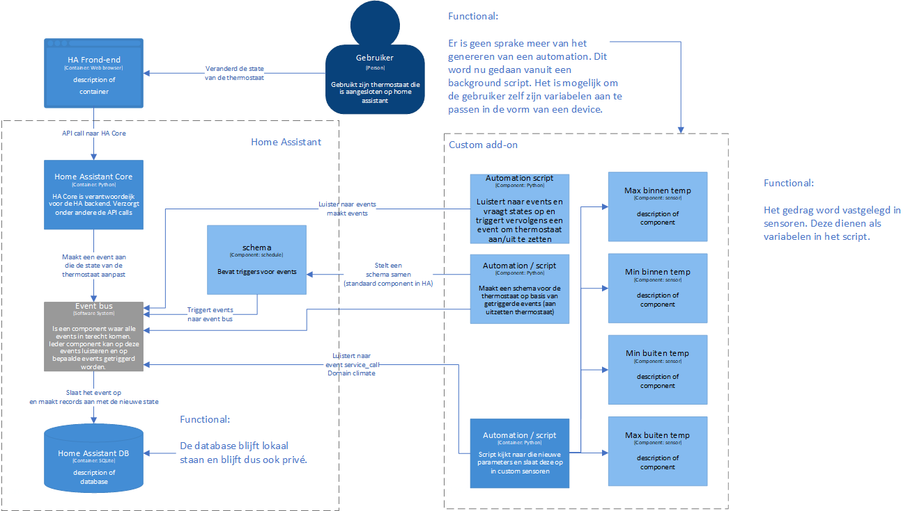
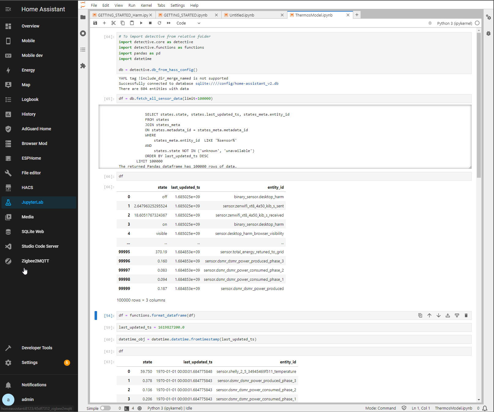

# Overzicht 

## Beoordelingen

| Leeruitkomst     | Undefined | Orienting | Beginning | Proficient | Advanced |
| ---------------- | --------- | --------- | --------- | ---------- | -------- |
| Analysis         |           |           | X         |            |          |
| Advice           |           |           | X         |            |          |
| Design           |           |           | X         |            |          |
| Implementation   |           |           | X         |            |          |
| Management       |           |           | X         |            |          |
| Judgement        |           |           | X         |            |          |
| Communication    |           |           |           | X          |          |
| Learning ability |           |           | X         |            |          |

## Deliverable matrix

| Product              | Analysis | Advice | Design | Implementation | Management | Judgement | Communication | Learning ability |
| -------------------- | -------- | ------ | ------ | -------------- | ---------- | --------- | ------------- | ---------------- |
| Projectplan          | X        |        |        |                |            | X         |               |                  |
| Presentaties         |          |        |        |                |            |           | X             |                  |
| Feedpulse            |          |        |        |                | X          | X         | X             | X                |
| Data Analyse         |          | X      |        |                |            | X         |               | X                |
| PoC (ML model)       |          |        |        | X              |            |           |               | X                |
| GIT repos            |          |        |        |                | X          |           |               |                  |
| Jira Project         |          |        |        |                | X          |           |               |                  |
| Project documentatie |          |        |        |                |            |           | X             |                  |
| Model ontwerp        |          |        | X      |                |            |           |               | X                |
| Requirement analysis | X        |        |        |                |            | X         |               | X                 |

# Leeruitkomsten

## 1. Analysis

*You are able to carry out a requirement analysis for a software system with various stakeholders in a context of existing systems. And, you can define acceptance criteria based on quality properties and a risk analysis carried out with, among others, attention for security aspects.*

### Iteratie 0
Voor dit onderwerp zal ik komende iteratie de data van home assistant gaan analyseren. Hiervoor heeft Home Assistant een [data science pagina](https://data.home-assistant.io/) waar in ze het een en ander uitleggen over de data binnen het platform. Ook kan ik hiervoor mijn persoonlijke data set analyseren. 

Wat ik uit de analyse wil halen is voornamelijk welke data bruikbaar is, wat mogelijke lables zijn en of er al globale verbindingen te leggen zijn tussen triggers en entitys. 

### Iteratie 1
Deze iteratie ben ik bezig geweest met wat voor onderzoen. Zoals de [data science pagina](https://data.home-assistant.io/) pagina doorlezen en de tools uitproberen die er worden aangereikt. Omdat ik hier nog in het vooronderzoek zit heb ik hier nog geen documentatie voor geschreven. De volgende iteratie wil ik hier een start mee maken. 

Bram, Bastiaan en ik zijn bezig geweest met het verfijnen van de [onderzoeksvragen](https://github.com/S7HaMachineLearning/documentation#15-onderzoeksvragen) en hebben hier ook de design challenge op toegepast. Deze hebben we ook gepresenteerd aan die klas. Hier hebben we een hoop feedback op gekregen die we ook direct hebben verwerkt in de vragen. 

### Iteratie 2

Deze iteratie hebben we met de groep gewerkt aan de product requirements. Zo hebben we samen uitgewerkt wie onze [doelgroep](https://github.com/S7HaMachineLearning/documentation/blob/main/README.md#114-doelgroep) is, verschillende [use cases](https://github.com/S7HaMachineLearning/documentation/blob/main/README.md#data-privacy---harm), [fuctionals](https://github.com/S7HaMachineLearning/documentation/blob/main/README.md#functional) en [operationals](https://github.com/S7HaMachineLearning/documentation/blob/main/README.md#operational) uitgewerkt. 
Daarnaast hebben we nog [Voorwaarden](https://github.com/S7HaMachineLearning/documentation/blob/main/README.md#13-begrenzing-en-randvoorwaarden) en [risico en uitwijkactiviteiten](https://github.com/S7HaMachineLearning/documentation/blob/main/README.md#52-risicos-en-uitwijkactiviteiten) beschreven. 

### Iteratie 3

Deze iteratie heb ik niet aan dit onderwerp gewerkt. 

### Iteratie 4

Deze iteratie ben ik aan de slag gegaan met het maken van verschillende stories. Een [story](https://prophecy1.atlassian.net/browse/AA-29) voor het analyseren van de Home Assistant data en een [story](https://prophecy1.atlassian.net/browse/AA-32) voor een PoC van een ML model. Ui deze 2 stories is nog een vervolg story gekomen Waarin ik een oplossing maak om een thermostaat slimmer te maken.   

### Iteratie 5

In deze iteratie heb ik als laatste actie de klantreis beschreven. Op deze manier kan ik met het schrijven van stories makkelijk inhaken op de kan zijn verwachtingen. 

### Conclusie

| iteratie | Undefined | Orienting | Beginning | Proficient | Advanced |
| -------- | --------- | --------- | --------- | ---------- | -------- |
| 0        |           | X         |           |            |          |
| 1        |           | X         |           |            |          |
| 2        |           |           | X         |            |          |
| 3        |           |           | X         |            |          |
| 4        |           |           | X         |            |          |
| 5        |           |           |           | X          |          |

Zelfbeoordeling: 
Ik heb mezelf met proficient beoordeeld. Ik heb laten zien dat ik user stories kan schrijven die inhaken op de gebruiker zijn verwachtingen. Daar bij heb ik duidelijke acceptatie criteria beschreven en onderzoeksvragen geformuleerd. 

---
## 2. Advice

*You are able to give advice concerning the choice of software architecture or existing software frameworks whereby cost aspects and quality properties such as availability, performance, security and scalability play a role. And, you can provide advice about the approach to take during the processing and consultation of large quantities of data with attention for privacy. Moreover, you are able to provide advice on the organisation of a software development process, including the test process.*

### Iteratie 0
In iteratie 1 zal ik een eerste advies maken hoe de data binnen home assistant gebruikt kan worden om gebruikers gedrag te herkennen. Dit zal ik na de analyse doen. 

### Iteratie 1
In deze iteratie ben ik nog niet toegekomen aan het analyseren van de data binnen home assistant. Er is meer tijd gegaan naar basiskennis over machine learning en de tools die daar voor gebruikt kunnen worden. 

### Iteratie 2 

Ik ben deze sprint met een [spike](https://github.com/S7HaMachineLearning/documentation/blob/main/Spikes/Harm/SPIKE%20bestaande%20toepassingen.md) begonnen maar deze is nog niet af. Om een goed advies te kunnen geven wil ik meerdere onderzoeken doen zodat ik verschillende invalshoeken heb om een geschikte techniek voor mijn project te kunnen adviseren.   

### Iteratie 3

Deze iteratie heb ik 2 [spikes](https://github.com/S7HaMachineLearning/documentation/tree/main/Spikes/Harm)kunnen afronden. Hier heb ik een advies gegeven voor het inzetten van machine learning binnen een home assistant omgeving. De volgende stap hierin is het toepassen hier van in een PoC. 

### Iteratie 4

Het advies moet ik nog op papier zetten maar is al wel duidelijk voor mij. In het kort: Machine Learning is voor het Climate domein in home assistant niet erg geschikt om slim te maken met machine learning. De data die hiervoor word opgeslagen is te weinig en het trainen van een model word al snel te zwaar voor een gemiddelde machine die home assistant draait. Daardoor zal je als snel gaan werken met een dataset die niet persoonlijk is en zal de accuraatheid nog lager worden. 

### Iteratie 5

Deze iteratie heb ik een [advies](https://github.com/S7HaMachineLearning/documentation/blob/main/Spikes/Harm/PoC%20Machine%20Learning%20model.md) uitgebracht die is gebaseerd op verschillende onderzoeken. De onderzoeken zijn gebaseerd op beschikbare oplossingen (Library: Available product analysis), een data analyse (Lab: Data Analytics) en een PoC die in het advies word toegelicht. 

Met alle onderzoeken die ik heb gedaan kan ik mijn onderzoeksvragen beantwoorden. 

- Welke AI technologie is toepasbaar voor het voorspellen van gebruikersgedrag (Machine Learning, Deep Learning, Robotic Process Automation).
	- In mijn PoC en bestaande toepassingen laat ik zien op basis van welke keuzes ik kies voor een machine learning model
- Wat zijn de voor en nadelen van de verschillende AI technologieën binnen Home assistant?
	- Door alle onderzoeken heen geef ik verschillende voor en nadelen
		- Beschikbare hardware
		- dataset grootte 
		- schone data
- Hoe kan de data uit Home Assistant gebruikt worden voor de gekozen techniek.
	- Dit word toegelicht in de [Data Analyse](https://github.com/S7HaMachineLearning/documentation/blob/main/Spikes/Harm/SPIKE%20Data%20Analyse.md) spike. 
- Welk platform, framework, library binnen te gekozen techniek is het meest geschikt voor het voorspellen van gedrag.
	- Dit word uitgelegd in [PoC Machine Learning model](https://github.com/S7HaMachineLearning/documentation/blob/main/Spikes/Harm/PoC%20Machine%20Learning%20model.md)

### Conclusie

| iteratie | Undefined | Orienting | Beginning | Proficient | Advanced |
| -------- | --------- | --------- | --------- | ---------- | -------- |
| 0        | X         |           |           |            |          |
| 1        |           | X         |           |            |          |
| 2        |           | X         |           |            |          |
| 3        |           |           | X         |            |          |
| 4        |           |           | X         |            |          |
| 5        |           |           |           | X          |          |

Op basis van het advies wat ik heb uitgebracht heb ik mijzelf een beoordeling proficient gegeven. Dit omdat ik een goed onderbouwd advies heb gegeven en antwoord kan geven op alle onderzoeksvragen. 

---
## 3. Design

*You are able to compile a software architecture for a software system that is comprised of existing and new systems, and takes several stakeholders quality properties into account, including security and scalability, as well as able to compile a test strategy for system tests.*

### Iteratie 0
Voor dit onderwerp heb ik meer onderzoek nodig om te weten hoe ik dit kan gaan aantonen binnen dit project

### Iteratie 1
Hier is nog niets veranderd ten opzichten van iteratie 0

### Iteratie 2
Hier is nog niets veranderd

### Iteratie 3

Deze iteratie hebben we met de groep een C4 ontwerp gemaakt (c1 en c2). Daarnaast heb ik ook al een eerste opzet gemaakt van een c3 ontwerp maar hier ben in nog niet te vreden over. Het c3 ontwerp wil ik nog verder uitwerken met goede omschrijvingen en wellicht de structuur nog aanpassen.  

### Iteratie 4

In deze iteratie heb ik de eerste versie van mijn C3 model gemaakt. Hier moet ik nog een duidelijke uitleg bij maken

### Iteratie 5

Deze iteratie heb ik mijn C3 model verder uitgewerkt met daarbij duidelijke uitleg over wat de relatie is van verschillende componenten en de daarbij behorende functionals die zijn opgenomen in het projectplan. 

### Conclusie

| iteratie | Undefined | Orienting | Beginning | Proficient | Advanced |
| -------- | --------- | --------- | --------- | ---------- | -------- |
| 0        | X         |           |           |            |          |
| 1        | X         |           |           |            |          |
| 2        |           | X         |           |            |          |
| 3        |           |           | X         |            |          |
| 4        |           |           | X         |            |          |
| 5        |           |           |           | X          |          |

Op basis van alle ontwerpen die ik heb gemaakt geef ik mezelf een Proficient. Ik heb laten zien dat ik mijn architectuur kan baseren op de functionals en een duidelijk ontwerp kan maken.

---
## 4. Implementation

*You are able to build and make available a scalable software system that correlates with existing systems, perhaps in the cloud, according to the designed architecture while using existing frameworks. You are able to apply test automation in carrying out tests.*

### Iteratie 0
Door verschillende proof of concepts te maken ga in aantonen dat ik begrijp hoe een machine learning model werkt en getraind kan worden. 

### Iteratie 1
Hier is nog niets veranderd ten opzichten van iteratie 0

### Iteratie 2
Hier is nog niets veranderd

### Iteratie 3

Ik heb een start gemaakt met het implementeren van mijn oplossing in Jupiter notebook. Ik heb deze kunnen koppelen met de database van mijn servicenow instance. Het is voor mij nog even uitzoeken hoe ik de juiste kolommen kan tonen met de juiste data er in. 

### Iteratie 4

Deze iteratie heb ik een aantal machine learning modellen gemaakt waarin ik de data uit home assistant gebruik om het model te trainen. Geen van alle modellen kan goed omgaan met de minimale data die ik uit home assistant kan halen. Ik heb een model die een hele goede score haalt bij het voorspellen van se staat van lampen die aan/uit staan. Dit model geeft aan dat het met voldoende simpele data een goed model kan trainen.  

### Iteratie 5

Deze Iteratie ben ik aan de slag gegaan met het maken van een automation Voor Home Assistant. Dit word gedaan in Python wat voor mij nog nieuw is. Voor dit semester heb ik hier nog niet eerder mee gewerkt. 

Ik heb al een volledige automation weten te schrijven die werkt met variabelen die de klant kan aanpassen. 

De volgende stap zou zijn om deze variabelen aan te gaan passen op basis van het gedrag van de klant. 

### Conclusie

| iteratie | Undefined | Orienting | Beginning | Proficient | Advanced |
| -------- | --------- | --------- | --------- | ---------- | -------- |
| 0        | X         |           |           |            |          |
| 1        | X         |           |           |            |          |
| 2        | X         |           |           |            |          |
| 3        |           | X         |           |            |          |
| 4        |           |           | X         |            |          |
| 5        |           |           | X         | X          |          |

Deze iteratie heb ik weer een hoop stappen gemaakt. Ik ben een andere richting in gegaan waardoor ik nog een hoop te doen heb qua ontwikkelwerk.  
Ik zou mezelf hier zeker geen beginning meer in geven gezien de ervaring die ik heb opgedaan in verhouding met het begin van het semester. Ik heb helaas nog niet het product af maar heb laten zien dat ik capabel ben om te ontwikkelen binnen home assistant. 

---
## 5. Management

*You are able to carry out configuration, change and release management in conjunction with infrastructure management. You can organize a development environment with automated build and test infrastructure.*

### Iteratie 0

#### samenwerken

Deze iteratie hebben we een eerste opzet gemaakt voor het samenwerken. We hebben hiervoor een [jira project](https://prophecy1.atlassian.net/jira/software/projects/AA/boards/2) voor aangemaakt en een [Github project](https://github.com/S7HaMachineLearning)

Het doel is om de taakverdeling in het jira project bij te houden door middel van agile/scrum toe te passen. Ieder maakt voor zijn eigen onderzoeksvraag een epic aan. Onder deze epics komen mijn eigen stories te staan. Zie [hier](https://prophecy1.atlassian.net/jira/software/projects/AA/boards/2/roadmap?assignee=6093ea8b539c14006ad73f38) de lijst met mijn aangemaakte epics en stories.  

### Iteratie 1
Deze iteratie heb ik een 2 tal stories opgevoerd voor mijn eerste epic en in de [sprint](https://prophecy1.atlassian.net/jira/software/projects/AA/boards/2) getrokken. 
Ook heb ik in Jira wat aanpassingen gedaan in de storie templates. Zo heb ik een veld 'coöperation' toegevoegd waarin je kan aangeven dat je meewerkt aan een story van een ander en heb ik een text veld toegevoegd waarin we als default waarde de Defenition of Done in kunnen verwerken. In de sprint heb ik een extra lane 'review' toegevoegd zodat we kunnen aangeven wanneer we een story gereviewed willen hebben. 

Github hebben we al vol op in gebruik voor onze documentatie. Ieder maakt voor zijn eigen spikes/onderzoeken een eigen branche aan waarin hij in zijn eigen map documenteerd. Door deze afspraak houd je de documentatie overzichtelijk en voorkom je problemen tijdens pushen en mergen. 

### Iteratie 2

Deze Sprint zijn we vooral nog bezig geweest met het afronden van ons project plan. Als dit goed is dan kunnen we meer vaart maken met onderzoeken en ontwikkelen. 

### Iteratie 3

Dit onderwerp is deze iteratie nog niet aangeraakt. 

### Iteratie 4

Hier heb ik nog een aantal vragen over
	- de modellen die ik nu heb getraind zullen nooit worden geïmplementeerd. Het lijkt mij dat het geen nut heeft om hier een teststraat voor op te zetten. 
	- Het volgende component wil ik in python schrijven. Dit lijkt mij wel de moeite waard om een test straat voor te maken. 

### Iteratie 5

In deze iteratie heb ik een [development omgeving](https://github.com/S7HaMachineLearning/devcontainer) opgezet voor Home Assistant en een [repository](https://github.com/S7HaMachineLearning/SmartThermostat) met daarin een pipeline die packages maakt die geïnstalleerd kunnen worden in Home Assistant. 

Deze container is bedoeld voor het ontwikkelen en testen van nieuwe functionaliteiten. 

### Conclusie

| iteratie | Undefined | Orienting | Beginning | Proficient | Advanced |
| -------- | --------- | --------- | --------- | ---------- | -------- |
| 0        |           |           | X         |            |          |
| 1        |           |           | X         |            |          |
| 2        |           |           | X         |            |          |
| 3        |           |           | X         |            |          |
| 4        |           |           | X         |            |          |
| 5        |           |           |           | X          |          |

Me de development instance en de pipeline heb ik alle tools om snel en efficient te kunnen ontwikkelen. De pipeline controleert of de code werkbaar is en maakt hier automatisch een package van zodat deze in de add-on store geïnstalleerd kan worden. En de development instance geeft de mogelijkheid om te kunnen ontwikkelen en testen.  

---
## 6. Judgement

*You are able to formulate appropriate research questions and secondary questions based on an unstructured practical issue, in all stages of the methodical process, and you are able to independently select research methods, carry them out and substantiate them with reference to research strategies in order to demonstrate the soundness of his research. Moreover you demonstrate that you are considerate towards social, international, scientific and ethical aspects in your analysis.*

### Iteratie 0

In iteratie 0 heb ik verschillende [onderzoeksvragen](https://github.com/S7HaMachineLearning/documentation/blob/main/README.md#onderzoeksvraag-1-hvg:~:text=Onderzoeksvraag%201%20HvG) geformuleerd. Met bijbehorende potentiële [onderzoeksmethoden](https://github.com/S7HaMachineLearning/documentation/blob/main/README.md#onderzoeksvraag-1-hvg:~:text=op%20onderstaande%20onderzoeksvragen.-,Potentiele%20onderzoeksmethode%3A,-(ictresearchmethods.nl)).  Deze zal ik in komende iteraties gaan toepassen in mijn onderzoek. Op basis van mijn onderzoek zal in aannames gaan doen waaruit zal gaan blijken wat mijn niveau zal zijn voor dit leerdoel 

### Iteratie 1

In deze iteratie heb ik aan al mijn sub-vragen [onderzoeksmethoden](https://github.com/S7HaMachineLearning/documentation#onderzoeksvraag-1-hvg) toegevoegd en onderbouwd waarom ik hiervoor heb gekozen. Ook heb ik samen met Bram en Bastiaan de design challenge toegepast op onze onderzoeksvragen. Hierdoor zijn ze meer concreet, smart en is de dynamiek tussen de vragen beter te volgen. We merkte vanuit de klas dat er nog wat verwarring was  over hoe de onderzoeksvragen onderling verband met elkaar hebben. 

### Iteratie 2

In iteratie 2 heb ik mijn [onderzoeksvragen](https://github.com/S7HaMachineLearning/documentation#onderzoeksvraag-1-hvg) gekoppeld aan onderzoeksmethoden met daarbij een onderbouwing. In de volgende iteratie is het belangrijk dat ik deze ga toepassen. 

### Iteratie 3

in deze iteratie heb ik ook mijn 2e [onderzoek](https://github.com/S7HaMachineLearning/documentation/tree/main/Spikes/Harm) en daarmee ook onderzoeksmethode kunnen toepassen. Hieruit heb ik al redelijk kunnen halen wanneer het inzetten van machinelearning nuttig is binnen een home assistant instance. Dit zou ik nog met een PoC verder willen uitzoeken.  

### Iteratie 4

Hier is eigenlijk het zelfde verhaal als in advise. Ik zal hiervoor mijn advies en conclusie op papier moeten zetten zodat ik dit onderwerp naar proficient kan zetten.

### Iteratie 5

Met alle onderzoeken die ik heb gedaan kan ik mijn onderzoeksvragen beantwoorden. 

- Welke AI technologie is toepasbaar voor het voorspellen van gebruikersgedrag (Machine Learning, Deep Learning, Robotic Process Automation).
	- In mijn PoC en bestaande toepassingen laat ik zien op basis van welke keuzes ik kies voor een machine learning model
- Wat zijn de voor en nadelen van de verschillende AI technologieën binnen Home assistant?
	- Door alle onderzoeken heen geef ik verschillende voor en nadelen
		- Beschikbare hardware
		- dataset grootte 
		- schone data
- Hoe kan de data uit Home Assistant gebruikt worden voor de gekozen techniek.
	- Dit word toegelicht in de [Data Analyse](https://github.com/S7HaMachineLearning/documentation/blob/main/Spikes/Harm/SPIKE%20Data%20Analyse.md) spike. 
- Welk platform, framework, library binnen te gekozen techniek is het meest geschikt voor het voorspellen van gedrag.
	- Dit word uitgelegd in [PoC Machine Learning model](https://github.com/S7HaMachineLearning/documentation/blob/main/Spikes/Harm/PoC%20Machine%20Learning%20model.md)

### Conclusie

| iteratie | Undefined | Orienting | Beginning | Proficient | Advanced |
| -------- | --------- | --------- | --------- | ---------- | -------- |
| 0        |           | X         |           |            |          |
| 1        |           |           | X         |            |          |
| 2        |           |           | X         |            |          |
| 3        |           |           | X         |            |          |
| 4        |           |           | X         |            |          |
| 5        |           |           |           | X          |          |

Voor dit onderwerp beoordeel ik mezelf met een Proficient. Ik heb laten zien dat ik onderzoek kan doen op basis van verschillende onderzoeksmethoden en dat ik hiermee antwoord heb kunnen geven op mijn onderzoeksvragen. 

---
## 7. Communication

*You are able to account for and defend the execution of a comprehensive professional assignment carried out in a realistic context, both orally and in writing, and are able to adapt the writing style to the intended audience either in Dutch or in English. Also, you are able to work effectively in a team in the independent execution of a professional assignment. Moreover you are able to function and work well in an international or intercultural environment, inside as well as outside the university of applied sciences.*

### iteratie 0 

#### Communicatie naar buiten

In deze iteratie is er veel gecommuniceerd rondom het project. Samen met Bastiaan en Bram heb ik ons idee voorgelegt aan Leon en Mark. Mijn twijfel op dat moment was voornamelijk of het onderwerp te splitsen was tussen ons 3e. Hier hebben we over gespart en besloten om het project wat te gaan uit werken. 

Nadat we het project wat hebben uit gewerkt hebben we dit ook gepitcht voor de klas en [feedback](https://fhict.instructure.com/courses/12928/external_tools/1067) opgehaald. Uit de feedback is voornamelijk naar voren gekomen dat het project gesplitst kan worden in 3 aparte onderdelen. Wel moeten we goed opletten dat er een duidelijke scheiding is tussen ons werk. In het hoofdstuk [Management](#5.%20Management#Iteratie%200) dieper op in gegaan.

Na de classicale pitch is de volgende stap om het project concreter te gaan maken. We hebben hiervoor de Fontys template gebruikt. Vervolgens zijn we weer feedback gaan ophalen bij de docenten. Omdat het project nu verder is uitgewerkt kan er concretere vragen gesteld worden en concretere feedback gegeven worden. Hier op word in **checkpoint 1** van [feedpulse](https://fhict.instructure.com/courses/12928/external_tools/1067) verder gereflecteerd. 

Als laatste in deze iteratie hebben we een [presentatie](https://github.com/S7HaMachineLearning/documentation/blob/main/Presentaties/Automated%20automations%20presentatie%2027022023.pdf) gegeven aan de klas en docenten over ons project. Hierop reflecteren we in **checkpoint 2** van [feedpulse](https://fhict.instructure.com/courses/12928/external_tools/1067). 

Wat ik heb opgemaakt uit alle feedback die we hebben ontvangen is dat het project ambitieus is en dat we goed in de gaten moeten houden of het project haalbaar is in combinatie van machine learning. Hiervoor is het belangrijk dat we goed blijven communiceren over de voortgang. Ook moeten we scherp blijven op het splitsen van onze werkzaamheden en afspraken maken over onderlinge afhankelijkheden.

#### communicatie binnen het project

Binnen het project hebben Bastiaan, Bram regelmatig contact momenten. Voor deze contact momenten zijn we nog zoekende hoe we het beste onze afspraken kunnen vastleggen. Dit kan bijvoorbeeld door een notule.

### Iteratie 1

In de voorgaande iteratie heb ik al aangegeven hoe we onderling en naar de groep hebben gecommuniceerd. Dit hebben we voort proberen te zetten door nog een presentatie te geven onder onze design challenge. Tijdens deze presentatie hadden we een goede interactie met de klas waardoor we veel waardevolle feedback hebben ontvangen op zowel onze challenge als ons project.

Daarnaast hebben we nog ons projectplan met de docenten besproken. Ik denk dat het projectplan nu ik een goede staat is op een aantal punten na. Deze kunnen we nog bespreken wanneer we het definitief indienen. 

### Iteratie 2
Deze itereatie hebben we met de groep verder samengewerkt aan het projectplan. Een aantal keer zijn we samen gekomen om het een en ander af te stemmen om dit vervolgens individueel uit te werken. Wat ik belangrijk vind om aan te geven is dat ik altijd mijn afspraken nakom voor de groep. Ook dat is een teken van heldere en goede communicatie. 

Qua presenteren heb ik deze iteratie nog niets gedaan. Wel probeer ik gerichte vragen te stellen wanneer er een presentatie word gegeven. Dit is met name wanneer ik mij hier op kan voorbereiden.

### Iteratie 3

Dit onderdeel heb ik niet behandeld deze iteratie. 

### Iteratie 4

Tegen de tijd dat ik mijn portfolio bespreek heb ik mijn presentatie gegeven. Zie [Presentatie](../att/Presentatie.md). 

### Conclusie

| iteratie | Undefined | Orienting | Beginning | Proficient | Advanced |
| -------- | --------- | --------- | --------- | ---------- | -------- |
| 0        |           |           | X         |            |          |
| 1        |           |           | X         |            |          |
| 2        |           |           | X         |            |          |
| 3        |           |           | X         |            |          |
| 4        |           |           |           | X          |          |
| 5        |           |           |           | X          |          |

Ik heb in de presentatie mijn voortgang besproken en mijn vervolg. Ook heb ik de problemen gepresenteerd waar ik tegenaan ben gelopen. De presentatie is nog wat ik nodig had om dit onderwerp naar proficient te zetten. 

---
## 8. Learning ability

*You are able to describe your professional talents and development ambitions in relation to the ICT profession, as well as able to reflect and receive feedback on your own performance in the ICT profession. You demonstrate initiative, and you have an independent attitude in which you work independently and in a result-oriented manner on professional assignments outside of the university of applied sciences.*

### Iteratie 0

Voor de start van iteratie 0 had ik nog geen basiskennis van machine learning. Na wat kort onderzoek op het web heb ik een idee wat je er mee kan en hoe/waar je het kan toepassen. In de komende iteraties (vanaf iteratie 1) ga ik dieper in op de materie Om zo daadwerkelijk te kunnen gaan bepalen of er een AI technologie is die ik kan gaan gebruiken voor dit project. 

### Iteratie 1

Deze iteratie heb ik vooral veel geleerd over het projectplan en de design challenge. Dit vind ik persoonlijk erg belangrijk omdat dit de basis is van het project maar ook mijn afstudeer project. Deze iteratie had ik wel wat meer willen doen met mijn stories die ik heb opgevoerd in Jira. Ik heb hier al wel een start mee gemaakt maar nog geen documentatie voor geschreven.  

### Iteratie 2

In deze iteratie ben ik gaan uitzoeken hoe ik in mijn project/ onderzoeksvraag use cases kan toepassen. Hier heb ik een eigen draai aan gegeven omdat ik niet iets bouw waar de gebruiker direct interactie mee heeft. Ik ben uit gegaan van een aantal key features voor Home assistant waarom veel gebruikers er gebruik van maken (data privacy). Deze heb ik in mijn [use case](https://github.com/S7HaMachineLearning/documentation#data-privacy---harm) verwerkt zodat deze feature blijft bestaan met de oplossing die we willen maken. Daarnaast heb ik wat onderzoekjes gedaan naar bestaande oplossingen en tools die ik kan gebruiken binnen Home Assistant voor het maken van een machine learning model of het schrijven van algoritmes. 

### Iteratie 3

Ik ben deze iteratie veel geleerd uit de onderzoeken die ik heb gedaan. Ik weet nu veel beter wat goede use cases zijn om machine learning toe te passen binnen een home assistant instance. Ook is het me duidelijk geworden dat een Algoritme is sommige situaties een betere optie zou zijn. Verder wil ik nog leren hoe ik machine learning kan inzetten en dit zal dan ook de volgende stap zijn om dit onderwerp naar proficient te zetten. 

### Iteratie 4

Deze iteratie heb ik geleerd hoe ik een machine learning model train en optimaliseer met verschillende parameters. Ik ben er achter gekomen hoe belangrijk het is om de juiste features en labels te gebruiken en hoe je je data kan opschonen. Helaas ben ik tot de conclusie gekomen dat de data uit home assistant niet voldoende is om een goed model te trainen en zal ik voor het voorspellen een andere methode moeten gebruiken.  

### Iteratie 5

Deze iteratie heb ik geleerd hoe ik kan ontwikkelen in Home Assistant. Ik merk wel dat de leer curve erg stijl is omdat er een minimale documentatie is als het gaat om api calls en functies die worden aangeboden door Home Assistant. 

Toch heb ik het voor elkaar weten te krijgen om een script te schrijven die de thermostaat automatiseert. 

### Conclusie

| iteratie | Undefined | Orienting | Beginning | Proficient | Advanced |
| -------- | --------- | --------- | --------- | ---------- | -------- |
| 0        |           | X         |           |            |          |
| 1        |           | X         |           |            |          |
| 2        |           | X         |           |            |          |
| 3        |           |           | X         |            |          |
| 4        |           |           | X         |            |          |
| 5        |           |           |           | X          |          |

Ik vind dat ik voldoende heb laten zien dat ik redelijk snel resultaat kan neerzetten met minimale kennis van een bepaalde techniek. In een week tijd heb ik al een automation kunnen maken voor Home Assistant en heb ik een pipeline / development omgeving kunnen opzetten. 

--- 
